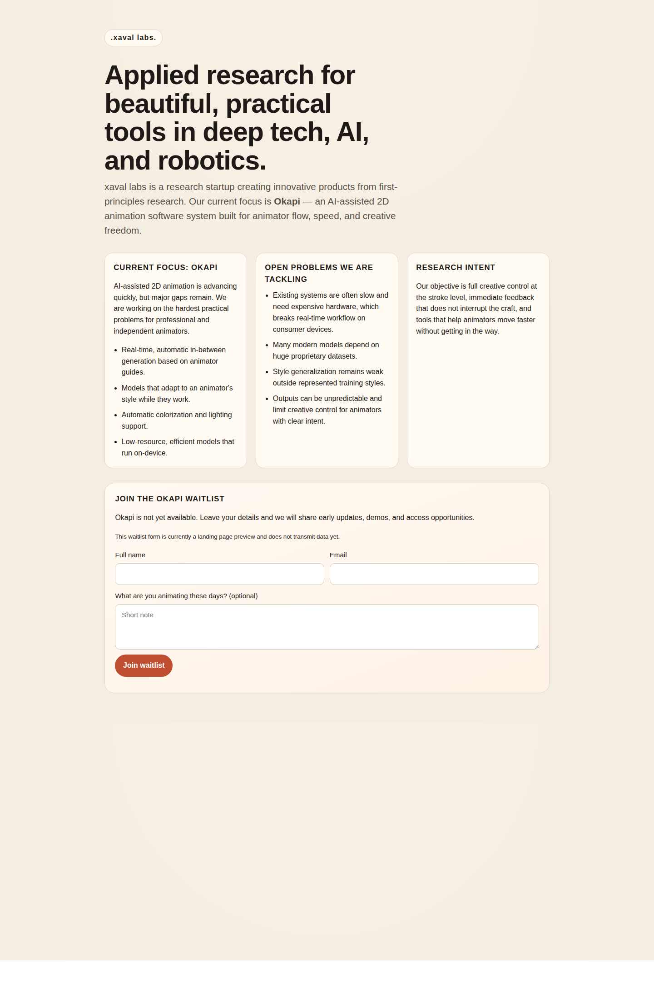

# xavallabs
xaval labs website.

## GitHub Pages deployment

This repo is a static site (`index.html` at the repo root), so it will auto-deploy on merge **if GitHub Pages is configured**:

1. Go to **Settings → Pages**
2. Under **Build and deployment**, choose **Deploy from a branch**
3. Select branch: `main` (or your default branch), folder: `/ (root)`
4. Save

Once enabled, each merge to that branch triggers a new Pages deployment automatically.

## Preview before merge

- **Local preview**:
  - Open `index.html` directly in a browser, or
  - Run: `python3 -m http.server 8000` from the repo root and visit `http://localhost:8000`
- **GitHub Pages preview path (after deploy)**:
  - `https://<owner>.github.io/<repo>/`
  - Example for this repository: `https://habbes.github.io/xavallabs/`

## Screenshot

